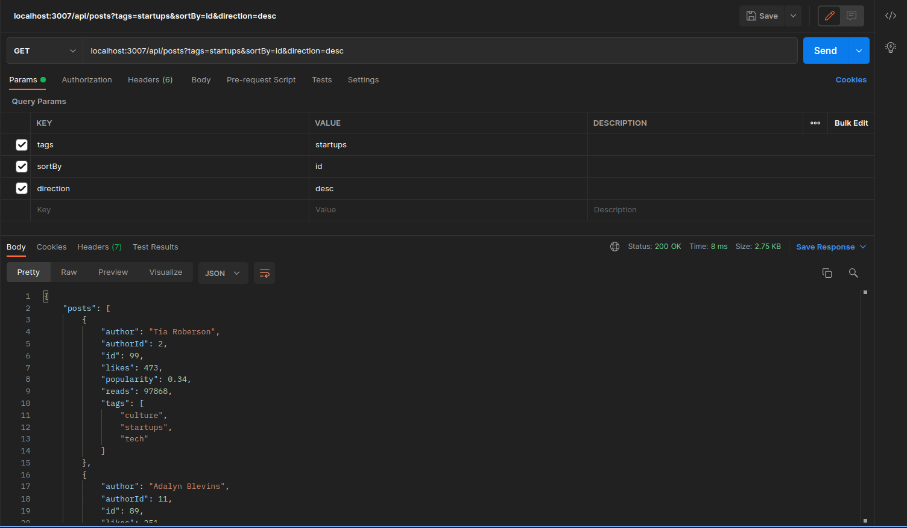

# Hatchways API
A RESTful API written as part of an assignment given by [hatchways.io](hatchways.io). 

## Description
This API accesses an external blog post API provided by hatchways.io and sorts the results by either id, popularity, likes, or reads in decending or ascending order. API results are also cached on the server to reduce network resource expendature and increase response time. Although the API has only two endpoints (/ping and /posts), it has been structured in such a way that supports futher development by organizing the code for clarity and ease of testing. Tests have been written using the Jest testing framework. 

### Sorting Algorithm 
The Merge Sort algorithm is used to order the posts by id, likes, popularity, or reads. It is contained in its own module to allow for easy testing as well as reuse throughout the application. Unit tests have been written for this module. 

### Server Side Cache
In order to reduce network resource expenditure as well as speed up response time, a server side cache has been implemented using the npm package "node-cache". The cache functionality is contained in its own module for easy testing as well as future expansion as neccessary. The cache stores posts in an object, using their ids as the key, to allow for quick access to individual posts as well as to prevent double saving of posts. 

The cache also has a method for retrieving all posts with certain tags, which tags an array of tags as an argument. 

The cache also has a set that keeps track of the tags included and a method to check if a certain tag 

## Testing
Unit tests were written for the following modules: 
* mergeSort.js
* serverCache.js
* fetchPostsByTags.js

As fetch is a newly available core node package, jest does not seem to yet support testing for it and thus the test has failed. 

## Dependancies
This project is dependant on the following npm packages: 
* express v4.17.3
* node-cache v5.1.2
* (unit testing) jest v27.5.1
* (unit testing) jest-sorted v1.0.14